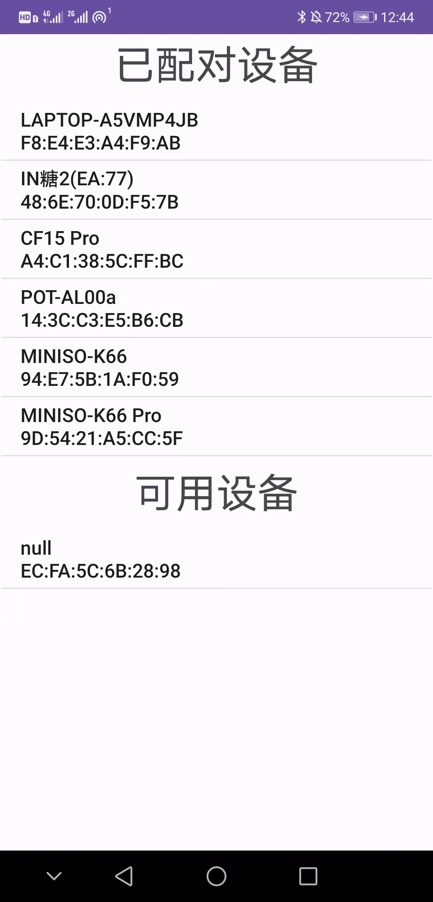
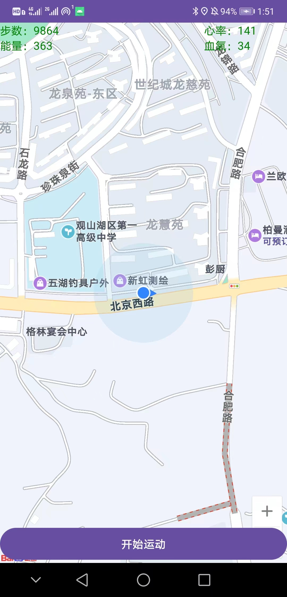
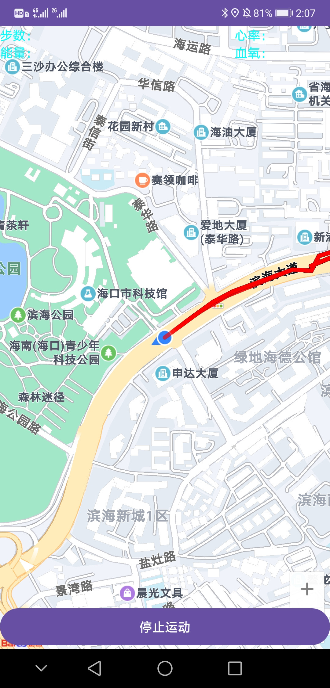

# 智能手环安卓APP上位机
对应的[智能手环嵌入式软件](https://github.com/B777B2056/SmartWatchEmbeddedSoftware)

## 1 功能
* 通过蓝牙连接[智能手环](https://github.com/B777B2056/SmartWatchEmbeddedSoftware)
* 监听来电信息并转发给智能手环
* 从智能手环获取步数、心率和血氧等健康信息并显示
* 接入[百度地图SDK](https://lbsyun.baidu.com/index.php?title=androidsdk)
* 实时定位
* 绘制动态运动轨迹

## 2 效果
### 2.1 蓝牙搜索

### 2.2 地图显示

### 2.3 运动轨迹绘制

